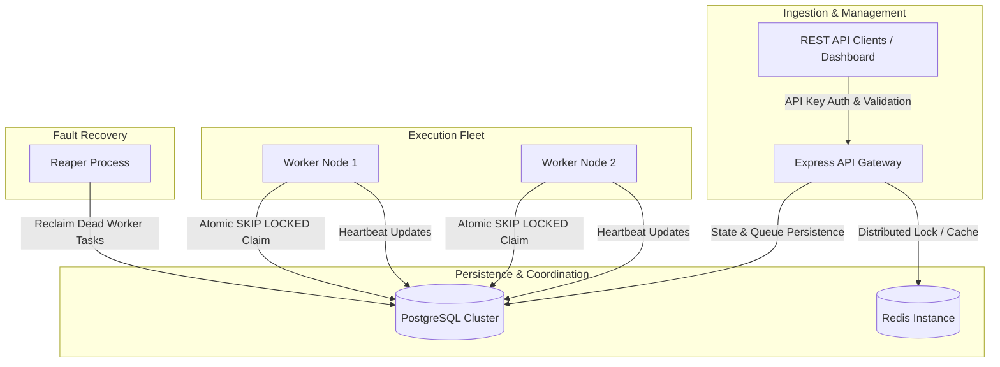
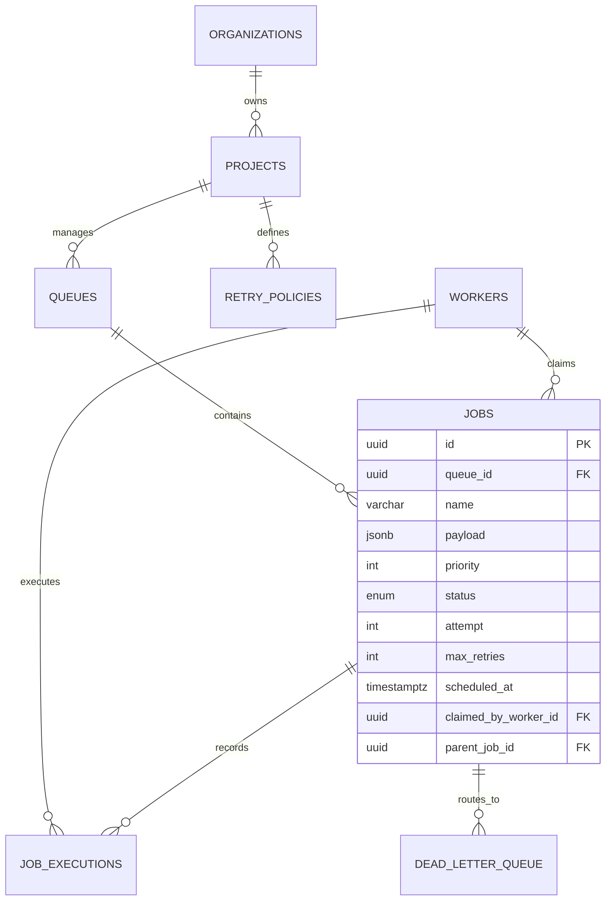

# Distributed Job Scheduler Platform

Production-ready distributed job scheduling platform built with TypeScript, Node.js, PostgreSQL, Redis, and Tailwind CSS.

## Quick Start (Docker Compose)

```bash
docker compose up --build


#  Production-Grade Distributed Job Scheduler

A high-throughput, multi-tenant background job orchestration engine designed to eliminate race conditions, handle worker node failures, manage complex DAG workflows, and provide live observability.

Built with **Node.js, TypeScript, PostgreSQL (Row-Level Locks), Redis, and Tailwind CSS**.

---

## 🌟 Key Architectural Features

* **Atomic Job Claiming (`FOR UPDATE SKIP LOCKED`)**: Guarantees zero duplicate executions across parallel worker nodes without centralized broker bottlenecking.
* **Resilient Worker Fleet**: Autonomous worker threads with real-time heartbeat emission, dynamic concurrency throttling, and graceful `SIGTERM`/`SIGINT` draining.
* **Zombie Process Reaper Daemon**: Automatically detects crashed worker nodes and re-enqueues orphaned in-flight tasks.
* **Configurable Retry & DLQ Lifecycle**: Supports `FIXED`, `LINEAR`, and `EXPONENTIAL` backoff with randomized jitter, automatically routing exhausted tasks to a Dead Letter Queue (DLQ) with one-click replay.
* **DAG Workflow Dependencies**: Declarative parent-to-child job dependencies that trigger downstream execution upon parent completion.
* **Distributed Cron & Scheduling**: Redis-locked cron evaluation for recurring tasks and precise timestamp-based delayed job dispatching.
* **Live Observability Console**: Web-based operator console with real-time queue health gauges, worker status monitoring, and DLQ management.

---

## 🏗️ System Architecture



---

## 🗄️ Database Entity-Relationship Diagram



---

## 🚀 Quick Start & Deployment

### Prerequisites
* Docker & Docker Compose installed and running.

### 1. Launch the Stack
Run this single command from the project root:

```bash
docker compose up -d --build
```

This launches all 6 isolated services:
* `scheduler-api` (Port `4000`)
* `scheduler-postgres` (Port `5433` -> `5432`)
* `scheduler-redis` (Port `6379`)
* `scheduler-worker-1` (5 Concurrent Workers)
* `scheduler-worker-2` (5 Concurrent Workers)
* `scheduler-reaper` (Zombie node detection daemon)

### 2. Access the Operator Console
Open your browser at:
```text
http://localhost:4000
```
Default API Key: `test-api-key-12345`

---

## 🧪 Verification & Sample Executions

### 1. Ingest Priority Batch Jobs
```bash
curl -X POST http://localhost:4000/api/v1/jobs/batch \
  -H "Content-Type: application/json" \
  -H "X-API-Key: test-api-key-12345" \
  -d '{
    "queueName": "critical-queue",
    "jobs": [
      {"name": "batch-task-1", "priority": 10},
      {"name": "batch-task-2", "priority": 5},
      {"name": "batch-task-3", "priority": 1}
    ]
  }'
```

**Response:**
```json
{
  "count": 3,
  "jobs": [
    { "id": "dfaf470e-1111-4444-8888-abcdef123456", "name": "batch-task-1", "status": "QUEUED", "priority": 10 },
    { "id": "20e31063-2222-4444-8888-abcdef123456", "name": "batch-task-2", "status": "QUEUED", "priority": 5 },
    { "id": "82c573b3-3333-4444-8888-abcdef123456", "name": "batch-task-3", "status": "QUEUED", "priority": 1 }
  ]
}
```

---

### 2. Trigger Failure, Retry Backoff & Dead Letter Isolation
```bash
curl -X POST http://localhost:4000/api/v1/jobs \
  -H "Content-Type: application/json" \
  -H "X-API-Key: test-api-key-12345" \
  -d '{
    "queueName": "default-queue",
    "name": "payment-gateway-timeout",
    "payload": { "forceFail": true }
  }'
```

**Execution Behavior:**
* Attempt 1: Fails immediately -> Schedules Attempt 2 (+5s delay + jitter).
* Attempt 2: Fails -> Schedules Attempt 3 (+10s delay + jitter).
* Attempt 3: Exhausts retry limit -> Transitions to `DEAD_LETTER` and inserts record into the DLQ table.

---

### 3. Replay Dead Letter Queue Jobs
```bash
curl -X POST http://localhost:4000/api/v1/dlq/replay-all \
  -H "X-API-Key: test-api-key-12345"
```

**Response:**
```json
{
  "replayed_count": 1
}
```

---

## 🛡️ Automated Concurrency & Race-Condition Tests

Run the Jest isolation test suite inside the container to verify claim atomicity across 50 concurrent worker requests:

```bash
docker exec -it scheduler-api npm test
```

**Expected Output:**
```text
 PASS  tests/concurrency.test.ts
  Distributed Concurrency & Claim Isolation
    ✓ guarantees strictly zero duplicate claims across 50 concurrent workers (489 ms)

Test Suites: 1 passed, 1 total
Tests:       1 passed, 1 total
Snapshots:   0 total
Time:        4.095 s
Ran all test suites.
```

---

## 🛑 Stopping the Services

```bash
docker compose down
```